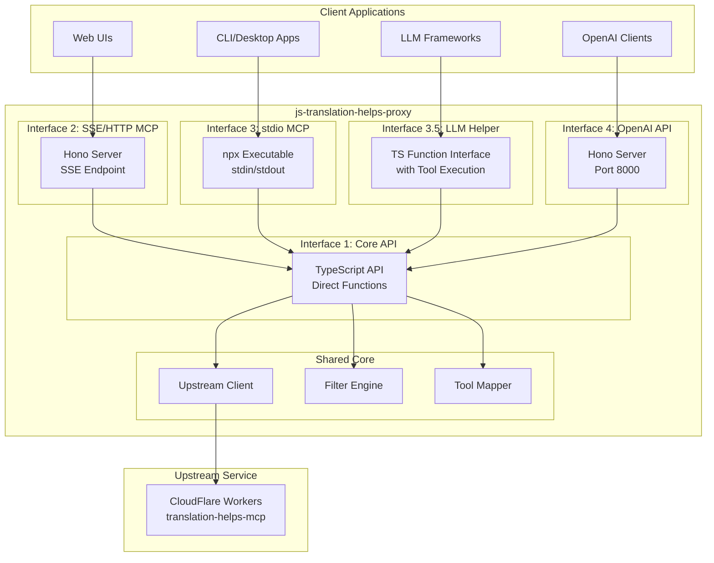

# Translation Helps Proxy - TypeScript Architecture

> **Version**: 1.0.0  
> **Target**: CloudFlare Workers + Node.js v20.17.0  
> **Based on**: Python translation_helps_mcp_proxy + MCP-Bridge

## Table of Contents

1. [Executive Summary](#executive-summary)
2. [System Overview](#system-overview)
3. [Architecture Interfaces](#architecture-interfaces)
4. [Core Components](#core-components)
5. [Tool Schemas](#tool-schemas)
6. [Filtering Mechanisms](#filtering-mechanisms)
7. [Project Structure](#project-structure)
8. [Dependencies](#dependencies)
9. [Testing Strategy](#testing-strategy)
10. [Implementation Roadmap](#implementation-roadmap)

---

## Executive Summary

This document defines the architecture for rewriting the Python-based MCP proxy system to TypeScript. The system provides a compliant MCP wrapper around the upstream CloudFlare endpoint at `https://translation-helps-mcp.pages.dev/api/mcp`, exposing it through four distinct interfaces.

**Key Design Principles:**
- CloudFlare Workers compatible (Edge runtime)
- Modular interface design (shared core, distinct interfaces)
- Preserve exact tool schemas from Python version
- Client-controlled filtering for Interfaces 1-3, baked-in for Interface 4
- Zero serialization overhead where possible

---

## System Overview



---

## Architecture Interfaces

### Interface 1: Core TypeScript API

**Purpose**: Direct programmatic access to upstream tools  
**Use Case**: TypeScript/JavaScript libraries, internal integrations

```typescript
import { TranslationHelpsClient } from 'js-translation-helps-proxy';

const client = new TranslationHelpsClient({
  upstreamUrl: 'https://translation-helps-mcp.pages.dev/api/mcp',
  enabledTools: ['fetch_scripture', 'fetch_translation_notes'],
  hiddenParams: ['language', 'organization'],
  filterBookChapterNotes: true
});

// Direct tool calls
const scripture = await client.fetchScripture({ reference: 'John 3:16' });
const notes = await client.fetchTranslationNotes({ reference: 'John 3:16' });

// List available tools
const tools = await client.listTools();

// Generic tool call
const result = await client.callTool('get_system_prompt', { 
  includeImplementationDetails: false 
});
```

**Key Features:**
- Zero MCP protocol overhead
- TypeScript type safety for all tools
- Promise-based async API
- Client-controlled filtering (optional)
- Automatic parameter injection for hidden params

---

### Interface 2: SSE/HTTP MCP Server

**Purpose**: MCP-over-HTTP for web clients  
**Use Case**: Web applications, browser-based LLM interfaces  
**Framework**: Hono (CloudFlare Workers compatible)

```typescript
// Server implementation (runs in same process as Interface 4)
import { Hono } from 'hono';
import { createMCPServer } from './mcp-server';

const app = new Hono();

const mcpServer = createMCPServer({
  enabledTools: process.env.ENABLED_TOOLS?.split(','),
  hiddenParams: process.env.HIDDEN_PARAMS?.split(','),
  filterBookChapterNotes: process.env.FILTER_NOTES === 'true'
});

// SSE endpoint
app.get('/mcp/sse', async (c) => {
  return mcpServer.handleSSE(c);
});

// HTTP POST endpoint for messages
app.post('/mcp/message', async (c) => {
  const message = await c.req.json();
  return c.json(await mcpServer.handleMessage(message));
});
```

**Client Usage:**
```typescript
// Using @modelcontextprotocol/sdk
import { Client } from '@modelcontextprotocol/sdk/client/index.js';
import { SSEClientTransport } from '@modelcontextprotocol/sdk/client/sse.js';

const transport = new SSEClientTransport(
  new URL('http://localhost:8000/mcp/sse')
);

const client = new Client({
  name: 'translation-helps-client',
  version: '1.0.0'
}, {
  capabilities: {}
});

await client.connect(transport);
const tools = await client.listTools();
const result = await client.callTool('fetch_scripture', { reference: 'John 3:16' });
```

**Protocol Flow:**
1. Client connects via SSE
2. Server sends initialization
3. Client sends tool requests via POST
4. Server streams responses via SSE
5. Client-controlled filtering via connection params

---

### Interface 3: stdio MCP Server

**Purpose**: Standard MCP stdio protocol  
**Use Case**: Desktop apps, CLI tools, Claude Desktop, Cline  
**Deployment**: npx executable

```bash
# Installation
npm install -g js-translation-helps-proxy

# Usage
translation-helps-proxy \
  --enabled-tools "fetch_scripture,fetch_translation_notes" \
  --hide-params "language,organization" \
  --filter-book-chapter-notes

# Or via npx
npx js-translation-helps-proxy --list-tools
```

**MCP Client Config (Claude Desktop, Cline):**
```json
{
  "mcpServers": {
    "translation-helps": {
      "command": "npx",
      "args": [
        "-y",
        "js-translation-helps-proxy",
        "--hide-params",
        "language,organization"
      ]
    }
  }
}
```

**Implementation:**
```typescript
#!/usr/bin/env node
import { Server } from '@modelcontextprotocol/sdk/server/index.js';
import { StdioServerTransport } from '@modelcontextprotocol/sdk/server/stdio.js';
import { TranslationHelpsCore } from './core';

const server = new Server({
  name: 'translation-helps-mcp-proxy',
  version: '1.0.0'
}, {
  capabilities: {
    tools: {}
  }
});

const core = new TranslationHelpsCore({
  enabledTools: args.enabledTools,
  hiddenParams: args.hiddenParams,
  filterBookChapterNotes: args.filterBookChapterNotes
});

// Register handlers
server.setRequestHandler(ListToolsRequestSchema, async () => {
  return { tools: await core.getFilteredTools() };
});

server.setRequestHandler(CallToolRequestSchema, async (request) => {
  const result = await core.callTool(request.params.name, request.params.arguments);
  return { content: result };
});

// Run
const transport = new StdioServerTransport();
await server.connect(transport);
```

---

### Interface 3.5: TypeScript Function Interface

**Purpose**: LLM integration helper with built-in tool execution  
**Use Case**: Custom LLM applications, agent frameworks

```typescript
import { createLLMInterface } from 'js-translation-helps-proxy/llm';

const llm = createLLMInterface({
  upstreamUrl: 'https://translation-helps-mcp.pages.dev/api/mcp',
  modelEndpoint: 'https://api.openai.com/v1/chat/completions',
  modelApiKey: process.env.OPENAI_API_KEY,
  enabledTools: ['fetch_scripture', 'fetch_translation_notes'],
  filterBookChapterNotes: true
});

// Automatic tool execution loop
const response = await llm.chat([
  { role: 'user', content: 'What does John 3:16 say?' }
]);

// Manual control
const { tools, messages } = await llm.prepareChatRequest([
  { role: 'user', content: 'What does John 3:16 say?' }
]);

// Send to LLM with tools
const completion = await fetch(modelEndpoint, {
  method: 'POST',
  headers: { 'Authorization': `Bearer ${apiKey}` },
  body: JSON.stringify({ model: 'gpt-4', messages, tools })
});

// Execute tool calls
const updatedMessages = await llm.executeToolCalls(
  messages,
  completion.choices[0].message.tool_calls
);
```

**Key Features:**
- Iterative tool execution loop (like MCP-Bridge)
- Automatic tool schema injection
- Support for any OpenAI-compatible endpoint
- Built-in result formatting

---

### Interface 4: OpenAI-Compatible REST API

**Purpose**: OpenAI API compatibility with MCP tools  
**Use Case**: OpenAI SDK clients, Open WebUI, LibreChat  
**Framework**: Hono (CloudFlare Workers compatible)  
**Port**: 8000  
**Filtering**: **Baked-in at server level** (not client-controlled)

```typescript
import { Hono } from 'hono';
import { createOpenAIBridge } from './openai-bridge';

const app = new Hono();

// Baked-in configuration (from environment)
const bridge = createOpenAIBridge({
  upstreamUrl: process.env.UPSTREAM_URL,
  enabledTools: process.env.ENABLED_TOOLS?.split(','),
  hiddenParams: ['language', 'organization'], // Always hidden
  filterBookChapterNotes: true, // Always enabled
  modelEndpoint: process.env.MODEL_ENDPOINT,
  modelApiKey: process.env.MODEL_API_KEY
});

// OpenAI-compatible endpoints
app.post('/v1/chat/completions', async (c) => {
  const request = await c.req.json();
  return c.json(await bridge.chatCompletions(request));
});

app.post('/v1/completions', async (c) => {
  const request = await c.req.json();
  return c.json(await bridge.completions(request));
});

app.get('/v1/models', async (c) => {
  return c.json(await bridge.listModels());
});

export default app;
```

**Usage Example:**
```typescript
import OpenAI from 'openai';

const client = new OpenAI({
  baseURL: 'http://localhost:8000/v1',
  apiKey: 'dummy' // Or actual API key if auth enabled
});

// Tools are automatically injected
const response = await client.chat.completions.create({
  model: 'gpt-4',
  messages: [
    { role: 'user', content: 'What does John 3:16 say about God?' }
  ]
});

// Streaming support
const stream = await client.chat.completions.create({
  model: 'gpt-4',
  messages: [{ role: 'user', content: 'Explain John 3:16' }],
  stream: true
});
```

**Key Differences from Interfaces 1-3:**
- Filtering is **baked into server config**, not client-controllable
- Tools are **always injected** into chat completions
- Iterative execution loop managed server-side
- Proxies to actual LLM endpoint (not just tool executor)

---

## Core Components

### 1. Upstream Client (`src/core/upstream-client.ts`)

```typescript
export interface UpstreamClientConfig {
  upstreamUrl: string;
  timeout?: number;
  headers?: Record<string, string>;
}

export class UpstreamClient {
  constructor(config: UpstreamClientConfig);
  
  // Core methods
  async listTools(): Promise<Tool[]>;
  async callTool(name: string, args: Record<string, any>): Promise<ToolResult>;
  
  // Internal routing
  private async routeToolCall(name: string, args: Record<string, any>): Promise<any>;
  private async fetchScriptureAPI(args: any): Promise<any>;
  private async fetchTranslationNotesAPI(args: any): Promise<any>;
  // ... other tool-specific routes
}
```

**Routing Logic** (preserved from Python):
```typescript
private routeToolCall(toolName: string, args: Record<string, any>) {
  const baseUrl = this.config.upstreamUrl.replace('/api/mcp', '');
  
  switch (toolName) {
    case 'fetch_scripture':
      return this.get(`${baseUrl}/api/fetch-scripture`, args);
    case 'fetch_translation_notes':
      return this.get(`${baseUrl}/api/translation-notes`, args);
    case 'fetch_translation_questions':
      return this.get(`${baseUrl}/api/translation-questions`, args);
    case 'get_translation_word':
    case 'fetch_translation_words':
      return this.get(`${baseUrl}/api/fetch-translation-words`, args);
    case 'browse_translation_words':
      return this.get(`${baseUrl}/api/browse-translation-words`, args);
    case 'get_context':
      return this.get(`${baseUrl}/api/get-context`, args);
    case 'extract_references':
      return this.get(`${baseUrl}/api/extract-references`, args);
    default:
      // Fallback to MCP endpoint
      return this.post(`${this.config.upstreamUrl}`, {
        method: 'tools/call',
        params: { name: toolName, arguments: args }
      });
  }
}
```

---

### 2. Filter Engine (`src/core/filter-engine.ts`)

```typescript
export interface FilterConfig {
  enabledTools?: string[];
  hiddenParams?: string[];
  filterBookChapterNotes?: boolean;
}

export class FilterEngine {
  constructor(config: FilterConfig);
  
  // Tool filtering
  filterTools(tools: Tool[]): Tool[];
  isToolEnabled(toolName: string): boolean;
  
  // Parameter filtering
  filterParameters(tool: Tool): Tool;
  
  // Response filtering
  filterBookChapterNotes(response: any): any;
}
```

**Implementation Details:**

```typescript
class FilterEngine {
  filterTools(tools: Tool[]): Tool[] {
    return tools
      .filter(tool => this.isToolEnabled(tool.name))
      .map(tool => this.filterParameters(tool));
  }
  
  filterParameters(tool: Tool): Tool {
    if (!this.config.hiddenParams || this.config.hiddenParams.length === 0) {
      return tool;
    }
    
    const schema = { ...tool.inputSchema };
    
    // Remove hidden params from properties
    if (schema.properties) {
      schema.properties = Object.fromEntries(
        Object.entries(schema.properties)
          .filter(([key]) => !this.config.hiddenParams.includes(key))
      );
    }
    
    // Remove from required list
    if (schema.required) {
      schema.required = schema.required.filter(
        param => !this.config.hiddenParams.includes(param)
      );
    }
    
    return { ...tool, inputSchema: schema };
  }
  
  filterBookChapterNotes(response: any): any {
    if (!this.config.filterBookChapterNotes || !response.items) {
      return response;
    }
    
    const filtered = response.items.filter((item: any) => {
      const ref = item.Reference || '';
      // Skip "front:intro" (book-level)
      if (ref === 'front:intro') return false;
      // Skip "N:intro" (chapter-level)
      if (ref.endsWith(':intro')) return false;
      return true;
    });
    
    return {
      ...response,
      items: filtered,
      metadata: {
        ...response.metadata,
        totalCount: filtered.length
      }
    };
  }
}
```

---

### 3. Tool Mapper (`src/core/tool-mapper.ts`)

```typescript
export interface MCPTool {
  name: string;
  description: string;
  inputSchema: JSONSchema;
}

export interface OpenAITool {
  type: 'function';
  function: {
    name: string;
    description: string;
    parameters: JSONSchema;
    strict?: boolean;
  };
}

export class ToolMapper {
  // MCP -> OpenAI
  static mcpToOpenAI(mcpTool: MCPTool): OpenAITool {
    return {
      type: 'function',
      function: {
        name: mcpTool.name,
        description: mcpTool.description,
        parameters: mcpTool.inputSchema,
        strict: false
      }
    };
  }
  
  // OpenAI -> MCP (for tool calls)
  static openAIToMCP(toolCall: OpenAIToolCall): {
    name: string;
    arguments: Record<string, any>;
  } {
    return {
      name: toolCall.function.name,
      arguments: JSON.parse(toolCall.function.arguments)
    };
  }
}
```

---

### 4. Response Formatter (`src/core/response-formatter.ts`)

```typescript
export class ResponseFormatter {
  // Format for MCP TextContent
  static toMCPContent(response: any): TextContent[] {
    if (!response) {
      return [{ type: 'text', text: 'No response from upstream server' }];
    }
    
    // Handle different response formats
    if (response.content) {
      // Already MCP format
      return response.content;
    }
    
    if (response.scripture) {
      // Scripture format
      return this.formatScripture(response.scripture);
    }
    
    if (response.notes || response.verseNotes || response.items) {
      // Translation notes format
      return this.formatNotes(response);
    }
    
    if (response.words) {
      // Translation words format
      return this.formatWords(response);
    }
    
    // Fallback: JSON stringify
    return [{ 
      type: 'text', 
      text: JSON.stringify(response, null, 2) 
    }];
  }
  
  private static formatScripture(scriptureList: any[]): TextContent[] {
    const formatted = scriptureList.map((s, i) => {
      let text = s.text;
      if (s.translation) {
        text += ` (${s.translation})`;
      }
      return text;
    }).join('\n\n');
    
    return [{ type: 'text', text: formatted }];
  }
  
  private static formatNotes(response: any): TextContent[] {
    const notes = response.notes || response.verseNotes || response.items;
    if (!notes.length) {
      return [{ type: 'text', text: 'No translation notes found for this reference.' }];
    }
    
    let text = `Translation Notes for ${response.reference || 'Reference'}:\n\n`;
    notes.forEach((note: any, i: number) => {
      const content = note.Note || note.note || note.text || note.content;
      text += `${i + 1}. ${content}\n\n`;
    });
    
    return [{ type: 'text', text }];
  }
  
  // ... other formatters
}
```

---

## Tool Schemas

All tool schemas must be preserved **exactly** as they exist in the Python version. Here are the complete schemas:

### 1. fetch_scripture

```typescript
export const fetchScriptureSchema = {
  name: 'fetch_scripture',
  description: 'Fetch Bible scripture text for a specific reference',
  inputSchema: {
    type: 'object',
    properties: {
      reference: {
        type: 'string',
        description: 'Bible reference (e.g., "John 3:16", "Romans 8:1-11")'
      },
      language: {
        type: 'string',
        description: 'Language code (default: "en")',
        default: 'en'
      },
      organization: {
        type: 'string',
        description: 'Organization name (default: "unfoldingWord")',
        default: 'unfoldingWord'
      }
    },
    required: ['reference']
  }
};
```

### 2. fetch_translation_notes

```typescript
export const fetchTranslationNotesSchema = {
  name: 'fetch_translation_notes',
  description: 'Fetch translation notes for a specific Bible reference',
  inputSchema: {
    type: 'object',
    properties: {
      reference: {
        type: 'string',
        description: 'Bible reference (e.g., "John 3:16")'
      },
      language: {
        type: 'string',
        description: 'Language code (default: "en")',
        default: 'en'
      },
      organization: {
        type: 'string',
        description: 'Organization name (default: "unfoldingWord")',
        default: 'unfoldingWord'
      }
    },
    required: ['reference']
  }
};
```

### 3. get_system_prompt

```typescript
export const getSystemPromptSchema = {
  name: 'get_system_prompt',
  description: 'Get the complete system prompt and constraints',
  inputSchema: {
    type: 'object',
    properties: {
      includeImplementationDetails: {
        type: 'boolean',
        description: 'Include implementation details (default: false)',
        default: false
      }
    },
    required: []
  }
};
```

### 4. fetch_translation_questions

```typescript
export const fetchTranslationQuestionsSchema = {
  name: 'fetch_translation_questions',
  description: 'Fetch translation questions for a specific Bible reference',
  inputSchema: {
    type: 'object',
    properties: {
      reference: {
        type: 'string',
        description: 'Bible reference (e.g., "John 3:16")'
      },
      language: {
        type: 'string',
        description: 'Language code (default: "en")',
        default: 'en'
      },
      organization: {
        type: 'string',
        description: 'Organization name (default: "unfoldingWord")',
        default: 'unfoldingWord'
      }
    },
    required: ['reference']
  }
};
```

### 5. get_translation_word

```typescript
export const getTranslationWordSchema = {
  name: 'get_translation_word',
  description: 'Get translation words linked to a specific Bible reference',
  inputSchema: {
    type: 'object',
    properties: {
      reference: {
        type: 'string',
        description: 'Bible reference (e.g., "John 3:16")'
      },
      wordId: {
        type: 'string',
        description: 'Specific word ID (optional)'
      },
      language: {
        type: 'string',
        description: 'Language code (default: "en")',
        default: 'en'
      },
      organization: {
        type: 'string',
        description: 'Organization name (default: "unfoldingWord")',
        default: 'unfoldingWord'
      }
    },
    required: ['reference']
  }
};
```

### 6. browse_translation_words

```typescript
export const browseTranslationWordsSchema = {
  name: 'browse_translation_words',
  description: 'Browse and search translation words by category or term',
  inputSchema: {
    type: 'object',
    properties: {
      language: {
        type: 'string',
        description: 'Language code (default: "en")',
        default: 'en'
      },
      organization: {
        type: 'string',
        description: 'Organization name (default: "unfoldingWord")',
        default: 'unfoldingWord'
      },
      category: {
        type: 'string',
        description: 'Category filter (optional)'
      },
      search: {
        type: 'string',
        description: 'Search term (optional)'
      },
      limit: {
        type: 'number',
        description: 'Maximum results to return (default: 50)',
        default: 50
      }
    },
    required: []
  }
};
```

### 7. get_context

```typescript
export const getContextSchema = {
  name: 'get_context',
  description: 'Get contextual information for a Bible reference',
  inputSchema: {
    type: 'object',
    properties: {
      reference: {
        type: 'string',
        description: 'Bible reference (e.g., "John 3:16")'
      },
      language: {
        type: 'string',
        description: 'Language code (default: "en")',
        default: 'en'
      },
      organization: {
        type: 'string',
        description: 'Organization name (default: "unfoldingWord")',
        default: 'unfoldingWord'
      }
    },
    required: ['reference']
  }
};
```

### 8. extract_references

```typescript
export const extractReferencesSchema = {
  name: 'extract_references',
  description: 'Extract and parse Bible references from text',
  inputSchema: {
    type: 'object',
    properties: {
      text: {
        type: 'string',
        description: 'Text containing Bible references'
      },
      includeContext: {
        type: 'boolean',
        description: 'Include contextual information (default: false)',
        default: false
      }
    },
    required: ['text']
  }
};
```

### 9-12. Additional Tools

```typescript
// fetch_resources, get_words_for_reference, search_resources, get_languages
// These follow similar patterns - will be discovered from upstream
```

**Note**: The actual tool list should be **dynamically discovered** from the upstream server on initialization, not hardcoded.

---

## Filtering Mechanisms

### Client-Controlled (Interfaces 1, 2, 3)

Filters are **optional** and controlled by the client at initialization:

```typescript
// Example: Different clients, different filters
const client1 = new TranslationHelpsClient({
  enabledTools: ['fetch_scripture'], // Only scripture
  hiddenParams: ['language', 'organization']
});

const client2 = new TranslationHelpsClient({
  // No filters - all tools, all params
});

const client3 = new TranslationHelpsClient({
  filterBookChapterNotes: true // Only filter notes
});
```

**When to Use:**
- `enabledTools`: Gradual rollout, testing, security restrictions
- `hiddenParams`: Downstream compatibility issues (e.g., bad language codes)
- `filterBookChapterNotes`: Cost reduction, redundancy elimination

---

### Baked-In (Interface 4: OpenAI API)

Filters are **required** and set at server startup from environment:

```bash
# .env
ENABLED_TOOLS=fetch_scripture,fetch_translation_notes,get_system_prompt
HIDDEN_PARAMS=language,organization
FILTER_BOOK_CHAPTER_NOTES=true
UPSTREAM_URL=https://translation-helps-mcp.pages.dev/api/mcp
MODEL_ENDPOINT=https://api.openai.com/v1
MODEL_API_KEY=sk-...
```

**Why Baked-In:**
- OpenAI clients don't control tool availability
- Server needs consistent behavior for caching
- Prevents unauthorized tool access
- Simplifies deployment (no per-client config)

---

## Project Structure

```
js-translation-helps-proxy/
├── package.json
├── tsconfig.json
├── .env.example
├── ARCHITECTURE.md (this file)
├── README.md
│
├── src/
│   ├── core/                      # Shared core logic
│   │   ├── upstream-client.ts     # HTTP client for upstream
│   │   ├── filter-engine.ts       # Tool/param/response filters
│   │   ├── tool-mapper.ts         # MCP <-> OpenAI conversion
│   │   ├── response-formatter.ts  # Response formatting
│   │   └── types.ts               # Shared TypeScript types
│   │
│   ├── interfaces/
│   │   ├── api/                   # Interface 1: Core API
│   │   │   ├── index.ts
│   │   │   └── client.ts
│   │   │
│   │   ├── mcp-server/            # Interface 2: SSE/HTTP MCP
│   │   │   ├── index.ts
│   │   │   ├── sse-handler.ts
│   │   │   └── http-handler.ts
│   │   │
│   │   ├── stdio/                 # Interface 3: stdio MCP
│   │   │   ├── index.ts
│   │   │   ├── cli.ts
│   │   │   └── server.ts
│   │   │
│   │   ├── llm-helper/            # Interface 3.5: LLM Helper
│   │   │   ├── index.ts
│   │   │   └── executor.ts
│   │   │
│   │   └── openai-bridge/         # Interface 4: OpenAI API
│   │       ├── index.ts
│   │       ├── chat-completions.ts
│   │       ├── completions.ts
│   │       └── streaming.ts
│   │
│   ├── schemas/                   # Tool schemas (dynamically loaded)
│   │   └── index.ts
│   │
│   └── index.ts                   # Main entry (exports all interfaces)
│
├── servers/                       # Deployable servers
│   ├── mcp-http.ts               # Interface 2 server
│   ├── stdio.ts                  # Interface 3 executable
│   └── openai-api.ts             # Interface 4 server
│
├── tests/
│   ├── unit/
│   │   ├── core/
│   │   │   ├── upstream-client.test.ts
│   │   │   ├── filter-engine.test.ts
│   │   │   └── response-formatter.test.ts
│   │   │
│   │   └── interfaces/
│   │       ├── api.test.ts
│   │       ├── mcp-server.test.ts
│   │       ├── stdio.test.ts
│   │       └── openai-bridge.test.ts
│   │
│   ├── integration/
│   │   ├── upstream-connectivity.test.ts
│   │   ├── tool-execution.test.ts
│   │   ├── parameter-hiding.test.ts
│   │   ├── note-filtering.test.ts
│   │   └── openai-workflow.test.ts
│   │
│   └── e2e/
│       ├── stdio-workflow.test.ts
│       └── openai-client.test.ts
│
├── examples/
│   ├── basic-usage.ts
│   ├── with-filtering.ts
│   ├── stdio-client.ts
│   ├── llm-integration.ts
│   └── openai-client.ts
│
└── docs/
    ├── getting-started.md
    ├── configuration.md
    ├── deployment.md
    └── api-reference.md
```

---

## Dependencies

### Core Dependencies

```json
{
  "dependencies": {
    "@modelcontextprotocol/sdk": "^1.0.0",
    "hono": "^4.0.0",
    "zod": "^3.22.0"
  },
  "devDependencies": {
    "@types/node": "^20.17.0",
    "typescript": "^5.3.0",
    "vitest": "^1.0.0",
    "@vitest/coverage-v8": "^1.0.0",
    "tsx": "^4.7.0"
  }
}
```

### Detailed Breakdown

**@modelcontextprotocol/sdk** (v1.0.0+)
- Purpose: MCP protocol implementation
- Used by: Interfaces 2, 3 (SSE/HTTP and stdio servers)
- Components needed:
  - `@modelcontextprotocol/sdk/server` - Server implementation
  - `@modelcontextprotocol/sdk/client` - Client utilities
  - `@modelcontextprotocol/sdk/types` - Type definitions

**hono** (v4.0.0+)
- Purpose: Lightweight web framework
- Used by: Interfaces 2, 4 (SSE/HTTP and OpenAI API)
- Features needed:
  - CloudFlare Workers support
  - SSE streaming
  - JSON body parsing
  - Middleware support
- Why Hono: CloudFlare Workers compatible, minimal overhead

**zod** (v3.22.0+)
- Purpose: Runtime type validation
- Used by: All interfaces
- Use cases:
  - Tool schema validation
  - Configuration validation
  - Response validation

### Optional Dependencies

```json
{
  "optionalDependencies": {
    "openai": "^4.0.0",        // For Interface 4 type safety
    "commander": "^11.0.0"      // For Interface 3 CLI parsing
  }
}
```

### Development Tools

```json
{
  "devDependencies": {
    "vitest": "^1.0.0",          // Testing framework
    "@vitest/coverage-v8": "^1.0.0", // Coverage
    "tsx": "^4.7.0",             // TypeScript execution
    "tsup": "^8.0.0",            // Bundler
    "prettier": "^3.0.0",        // Code formatting
    "eslint": "^8.50.0",         // Linting
    "@typescript-eslint/parser": "^6.0.0",
    "@typescript-eslint/eslint-plugin": "^6.0.0"
  }
}
```

### Runtime Compatibility

**Node.js**: v20.17.0 (LTS)
- ESM modules
- Native fetch API
- Web Streams API

**CloudFlare Workers**:
- Hono framework compatible
- No Node.js-specific APIs in worker code
- Use Web APIs (fetch, ReadableStream, etc.)

**Edge Runtime Considerations**:
```typescript
// Good: Web-standard fetch
const response = await fetch(url);

// Bad: Node.js specific
const http = require('http'); // ❌ Not available in CF Workers

// Good: Web Streams
const stream = new ReadableStream();

// Bad: Node streams
const { Readable } = require('stream'); // ❌ Not available in CF Workers
```

---

## Testing Strategy

### Test Pyramid

```
        E2E Tests (5%)
     ┌──────────────────┐
     │  Full workflows  │
     └──────────────────┘
           │
    Integration Tests (25%)
  ┌─────────────────────────┐
  │ Component interactions  │
  │ Upstream connectivity   │
  └─────────────────────────┘
          │
   Unit Tests (70%)
┌──────────────────────────────┐
│ Core logic                   │
│ Filters, formatters, mappers │
│ Pure functions               │
└──────────────────────────────┘
```

### Unit Tests (70% coverage target)

**Test Files**: `tests/unit/`

```typescript
// Example: filter-engine.test.ts
describe('FilterEngine', () => {
  describe('tool filtering', () => {
    it('should filter tools by enabled list', () => {
      const filter = new FilterEngine({ enabledTools: ['tool1', 'tool2'] });
      const tools = [
        { name: 'tool1', description: 'Test 1', inputSchema: {} },
        { name: 'tool2', description: 'Test 2', inputSchema: {} },
        { name: 'tool3', description: 'Test 3', inputSchema: {} }
      ];
      
      const filtered = filter.filterTools(tools);
      expect(filtered).toHaveLength(2);
      expect(filtered.map(t => t.name)).toEqual(['tool1', 'tool2']);
    });
    
    it('should return all tools when no filter specified', () => {
      const filter = new FilterEngine({});
      const tools = [...]; // 12 tools
      const filtered = filter.filterTools(tools);
      expect(filtered).toHaveLength(12);
    });
  });
  
  describe('parameter hiding', () => {
    it('should remove hidden params from properties', () => {
      const filter = new FilterEngine({ hiddenParams: ['language', 'organization'] });
      const tool = {
        name: 'fetch_scripture',
        inputSchema: {
          properties: { reference: {}, language: {}, organization: {} },
          required: ['reference', 'language']
        }
      };
      
      const filtered = filter.filterParameters(tool);
      expect(filtered.inputSchema.properties).not.toHaveProperty('language');
      expect(filtered.inputSchema.required).toEqual(['reference']);
    });
  });
  
  describe('book/chapter note filtering', () => {
    it('should remove front:intro notes', () => {
      const filter = new FilterEngine({ filterBookChapterNotes: true });
      const response = {
        items: [
          { Reference: 'front:intro', Note: 'Book intro' },
          { Reference: '3:16', Note: 'Verse note' }
        ],
        metadata: { totalCount: 2 }
      };
      
      const filtered = filter.filterBookChapterNotes(response);
      expect(filtered.items).toHaveLength(1);
      expect(filtered.items[0].Reference).toBe('3:16');
      expect(filtered.metadata.totalCount).toBe(1);
    });
    
    it('should remove chapter intro notes', () => {
      const filter = new FilterEngine({ filterBookChapterNotes: true });
      const response = {
        items: [
          { Reference: '3:intro', Note: 'Chapter intro' },
          { Reference: '3:16', Note: 'Verse note' }
        ]
      };
      
      const filtered = filter.filterBookChapterNotes(response);
      expect(filtered.items).toHaveLength(1);
    });
  });
});
```

### Integration Tests (25% coverage target)

**Test Files**: `tests/integration/`

```typescript
// Example: upstream-connectivity.test.ts
describe('Upstream Connectivity', () => {
  it('should connect to upstream server', async () => {
    const client = new UpstreamClient({
      upstreamUrl: 'https://translation-helps-mcp.pages.dev/api/mcp'
    });
    
    const tools = await client.listTools();
    expect(tools).toBeDefined();
    expect(tools.length).toBeGreaterThan(0);
  });
  
  it('should call fetch_scripture tool', async () => {
    const client = new UpstreamClient({ upstreamUrl: UPSTREAM_URL });
    const result = await client.callTool('fetch_scripture', {
      reference: 'John 3:16'
    });
    
    expect(result).toBeDefined();
    expect(result.scripture).toBeDefined();
    expect(result.scripture[0].text).toContain('God');
  });
});

// Example: tool-execution.test.ts
describe('Tool Execution', () => {
  it('should execute fetch_translation_notes with filtering', async () => {
    const client = new TranslationHelpsClient({
      filterBookChapterNotes: true
    });
    
    const result = await client.fetchTranslationNotes({
      reference: 'John 3:16'
    });
    
    // Should not contain book/chapter notes
    const bookNotes = result.items.filter(i => i.Reference === 'front:intro');
    expect(bookNotes).toHaveLength(0);
    
    const chapterNotes = result.items.filter(i => i.Reference.endsWith(':intro'));
    expect(chapterNotes).toHaveLength(0);
  });
});
```

### End-to-End Tests (5% coverage target)

**Test Files**: `tests/e2e/`

```typescript
// Example: stdio-workflow.test.ts
describe('stdio MCP Workflow', () => {
  it('should complete full MCP handshake and tool call', async () => {
    const process = spawn('node', ['dist/servers/stdio.js']);
    
    // Send initialize
    process.stdin.write(JSON.stringify({
      jsonrpc: '2.0',
      id: 1,
      method: 'initialize',
      params: {
        protocolVersion: '2024-11-05',
        clientInfo: { name: 'test', version: '1.0.0' }
      }
    }) + '\n');
    
    // Wait for response
    const initResponse = await waitForResponse(process.stdout);
    expect(initResponse.result.serverInfo.name).toBe('translation-helps-mcp-proxy');
    
    // Send tools/list
    process.stdin.write(JSON.stringify({
      jsonrpc: '2.0',
      id: 2,
      method: 'tools/list'
    }) + '\n');
    
    const toolsResponse = await waitForResponse(process.stdout);
    expect(toolsResponse.result.tools.length).toBeGreaterThan(0);
    
    // Call fetch_scripture
    process.stdin.write(JSON.stringify({
      jsonrpc: '2.0',
      id: 3,
      method: 'tools/call',
      params: {
        name: 'fetch_scripture',
        arguments: { reference: 'John 3:16' }
      }
    }) + '\n');
    
    const callResponse = await waitForResponse(process.stdout);
    expect(callResponse.result.content[0].text).toContain('God');
    
    process.kill();
  });
});

// Example: openai-client.test.ts
describe('OpenAI Client Integration', () => {
  it('should complete chat with tools', async () => {
    // Start server
    const server = startServer('dist/servers/openai-api.js');
    
    // Use OpenAI SDK
    const client = new OpenAI({
      baseURL: 'http://localhost:8000/v1',
      apiKey: 'test'
    });
    
    const response = await client.chat.completions.create({
      model: 'gpt-4',
      messages: [
        { role: 'user', content: 'What does John 3:16 say?' }
      ]
    });
    
    expect(response.choices[0].message.content).toBeDefined();
    // Should have called fetch_scripture tool
    
    server.close();
  });
});
```

### Test Configuration

```typescript
// vitest.config.ts
import { defineConfig } from 'vitest/config';

export default defineConfig({
  test: {
    globals: true,
    environment: 'node',
    coverage: {
      provider: 'v8',
      reporter: ['text', 'json', 'html'],
      exclude: [
        'node_modules/',
        'tests/',
        'dist/',
        '**/*.test.ts',
        '**/*.spec.ts'
      ],
      thresholds: {
        lines: 70,
        functions: 70,
        branches: 70,
        statements: 70
      }
    },
    include: ['tests/**/*.test.ts'],
    testTimeout: 30000 // 30s for integration tests
  }
});
```

### Test Matrix

| Test Type | Count | Focus | Runtime |
|-----------|-------|-------|---------|
| Unit | ~50 | Pure functions, filters, formatters | Fast (<1s each) |
| Integration | ~15 | API calls, tool execution | Medium (1-5s each) |
| E2E | ~5 | Full workflows, real clients | Slow (5-10s each) |
| **Total** | **~70** | **Complete coverage** | **~2-3 min** |

---

## Implementation Roadmap

### Phase 1: Core Foundation (Week 1)

**Goal**: Establish core logic with no interface dependencies

- [ ] Set up project structure
- [ ] Configure TypeScript, ESLint, Prettier
- [ ] Implement `UpstreamClient`
  - [ ] Tool listing
  - [ ] Tool routing logic
  - [ ] Response handling
- [ ] Implement `FilterEngine`
  - [ ] Tool filtering
  - [ ] Parameter hiding
  - [ ] Note filtering
- [ ] Implement `ResponseFormatter`
  - [ ] Scripture format
  - [ ] Notes format
  - [ ] Words format
- [ ] Unit tests for core (70% coverage)

**Deliverable**: Core library passing all unit tests

---

### Phase 2: Interface 1 - Core API (Week 2)

**Goal**: TypeScript API for direct usage

- [ ] Implement `TranslationHelpsClient`
- [ ] Type-safe method signatures
- [ ] Configuration options
- [ ] Examples and documentation
- [ ] Integration tests with upstream

**Deliverable**: Published npm package, usable as library

---

### Phase 3: Interface 3 - stdio MCP Server (Week 2-3)

**Goal**: npx executable for MCP clients

- [ ] Implement stdio server using MCP SDK
- [ ] CLI argument parsing
- [ ] MCP protocol handlers
- [ ] E2E tests with actual MCP clients
- [ ] Documentation for Claude Desktop, Cline

**Deliverable**: npm executable, ready for MCP clients

---

### Phase 4: Interface 2 - SSE/HTTP MCP Server (Week 3)

**Goal**: MCP-over-HTTP using Hono

- [ ] Implement SSE endpoint
- [ ] HTTP message endpoint
- [ ] Session management
- [ ] Deploy to CloudFlare Workers
- [ ] Integration tests

**Deliverable**: Deployed SSE server, web client examples

---

### Phase 5: Interface 3.5 - LLM Helper (Week 4)

**Goal**: TypeScript function interface for LLMs

- [ ] Implement tool execution loop
- [ ] LLM integration examples
- [ ] Automatic schema injection
- [ ] Documentation and examples

**Deliverable**: Helper library with examples

---

### Phase 6: Interface 4 - OpenAI API (Week 4-5)

**Goal**: Full OpenAI-compatible server

- [ ] Implement `/v1/chat/completions`
  - [ ] Non-streaming
  - [ ] Streaming (SSE)
- [ ] Implement `/v1/completions`
- [ ] Implement `/v1/models`
- [ ] Tool injection middleware
- [ ] Iterative execution loop
- [ ] Deploy to CloudFlare Workers
- [ ] E2E tests with OpenAI SDK

**Deliverable**: Production-ready OpenAI-compatible API

---

### Phase 7: Testing & Documentation (Week 5-6)

**Goal**: Production readiness

- [ ] Comprehensive test suite
- [ ] Performance benchmarks
- [ ] API documentation (TypeDoc)
- [ ] Deployment guides
- [ ] Example projects
- [ ] CI/CD setup (GitHub Actions)

**Deliverable**: Complete, documented, tested project

---

## Deployment Scenarios

### Development

```bash
# Local development
npm run dev                      # Start all servers in watch mode
npm run dev:stdio                # stdio server only
npm run dev:openai               # OpenAI API only
npm run dev:mcp-http             # MCP HTTP server only

# Testing
npm test                         # All tests
npm run test:unit                # Unit tests only
npm run test:integration         # Integration tests
npm run test:e2e                 # E2E tests
npm run test:coverage            # Coverage report
```

### Production - Node.js

```bash
# Build
npm run build

# Run servers
node dist/servers/stdio.js
node dist/servers/openai-api.js
node dist/servers/mcp-http.js

# Or via npm scripts
npm run start:stdio
npm run start:openai
npm run start:mcp-http
```

### Production - CloudFlare Workers

```bash
# Deploy OpenAI API
wrangler deploy servers/openai-api.ts --name translation-helps-openai

# Deploy MCP HTTP server
wrangler deploy servers/mcp-http.ts --name translation-helps-mcp

# With environment variables
wrangler secret put ENABLED_TOOLS
wrangler secret put MODEL_API_KEY
```

### Docker

```dockerfile
FROM node:20-alpine

WORKDIR /app
COPY package*.json ./
RUN npm ci --production
COPY dist/ ./dist/

# OpenAI API
EXPOSE 8000
CMD ["node", "dist/servers/openai-api.js"]

# Or MCP HTTP
EXPOSE 3000
CMD ["node", "dist/servers/mcp-http.js"]
```

### NPM Package

```json
{
  "name": "js-translation-helps-proxy",
  "version": "1.0.0",
  "main": "dist/index.js",
  "types": "dist/index.d.ts",
  "bin": {
    "translation-helps-proxy": "dist/servers/stdio.js"
  },
  "exports": {
    ".": "./dist/index.js",
    "./api": "./dist/interfaces/api/index.js",
    "./llm": "./dist/interfaces/llm-helper/index.js"
  }
}
```

---

## Summary

This architecture provides:

1. **Four distinct interfaces** for different use cases
2. **Shared core logic** to minimize duplication
3. **Exact tool schema preservation** from Python version
4. **Flexible filtering** (client-controlled vs baked-in)
5. **CloudFlare Workers compatibility** for edge deployment
6. **Comprehensive testing strategy** (70 tests, 70% coverage)
7. **Clear implementation roadmap** (6-week timeline)

The TypeScript rewrite maintains all functionality of the Python version while adding:
- Type safety
- Edge runtime support
- Multiple interface options
- Better performance (V8 vs CPython)
- Modern tooling ecosystem

**Next Steps**: Review this architecture, provide feedback, then proceed to implementation starting with Phase 1 (Core Foundation).