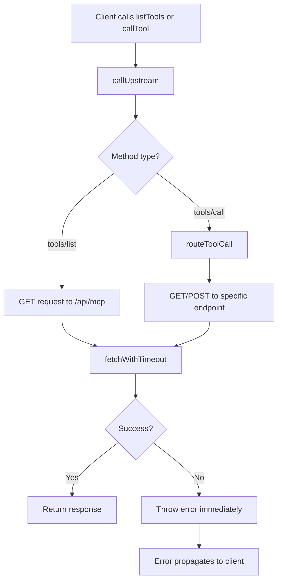
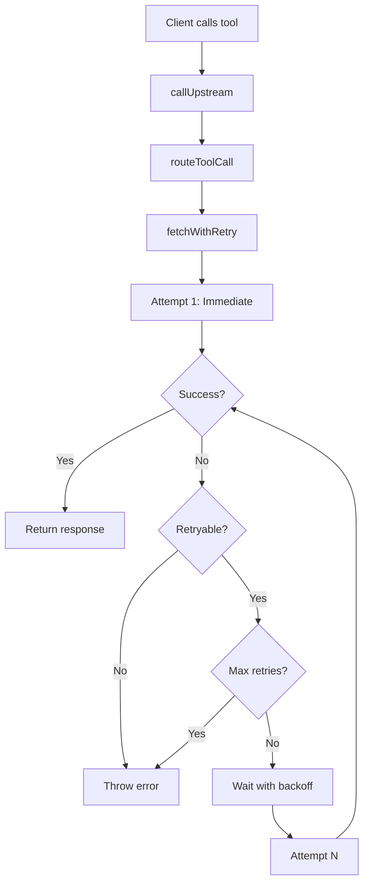

# Retry Mechanism for Cloudflare Worker Cold Starts

> **Status**: Design Document  
> **Version**: 1.0  
> **Date**: 2025-11-18  
> **Author**: Architecture Team

## Table of Contents

1. [Problem Statement](#problem-statement)
2. [Current Implementation](#current-implementation)
3. [Proposed Solution](#proposed-solution)
4. [Configuration Options](#configuration-options)
5. [Implementation Details](#implementation-details)
6. [Retry Strategies](#retry-strategies)
7. [Error Handling](#error-handling)
8. [Testing Strategy](#testing-strategy)
9. [Performance Impact](#performance-impact)
10. [Migration Guide](#migration-guide)

---

## Problem Statement

### The Issue

The upstream Translation Helps API is hosted on Cloudflare Workers, which exhibit classic "cold start" behavior:

- **First call**: Worker is cold → initialization delay → may timeout or fail
- **Second call**: Worker is warm → responds quickly → succeeds

This creates a poor user experience where the first API call often fails, but subsequent calls work fine.

### Current Behavior

```typescript
// Current implementation in fetchWithTimeout()
const controller = new AbortController();
const timeoutId = setTimeout(() => controller.abort(), this.config.timeout);

try {
  const response = await fetch(url, {
    ...options,
    signal: controller.signal
  });
  clearTimeout(timeoutId);
  return response;
} catch (error) {
  clearTimeout(timeoutId);
  if (error instanceof Error && error.name === 'AbortError') {
    throw new UpstreamConnectionError(`Request timed out after ${this.config.timeout}ms`);
  }
  throw error;
}
```

**Problems:**
- No retry logic - fails immediately on any error
- 30-second timeout is generous but doesn't help with cold starts
- Network errors and timeouts are treated the same as permanent failures

---

## Current Implementation

### Timeout Configuration

Located in [`src/core/upstream-client.ts`](src/core/upstream-client.ts:24):

```typescript
constructor(config: UpstreamClientConfig) {
  this.config = {
    upstreamUrl: config.upstreamUrl,
    timeout: config.timeout ?? 30000,  // 30 seconds default
    headers: config.headers ?? {}
  };
}
```

### Call Flow



**Key observations**:
- There is **zero retry logic** in the current implementation
- **Both `listTools()` and `callTool()` use the same `fetchWithTimeout()` method**
- This means the retry mechanism will work for **all upstream calls**

---

## Proposed Solution

### Overview

Implement an intelligent retry mechanism with exponential backoff that:
1. Automatically retries transient failures (network errors, timeouts, 5xx responses)
2. Does NOT retry permanent failures (4xx client errors, invalid arguments)
3. Uses exponential backoff to avoid overwhelming cold workers
4. Is fully configurable with sensible defaults
5. Provides detailed logging for debugging
6. **Works for ALL upstream calls** - both `listTools()` and `callTool()`

### Universal Coverage

Since both [`listTools()`](src/core/upstream-client.ts:32) and [`callTool()`](src/core/upstream-client.ts:58) flow through the same [`callUpstream()`](src/core/upstream-client.ts:76) → [`fetchWithTimeout()`](src/core/upstream-client.ts:228) path, **the retry mechanism automatically handles all upstream API calls**:

✅ **`listTools()`** - GET request to `/api/mcp?method=tools/list`
✅ **`callTool('fetch_scripture', ...)`** - GET request to `/api/fetch-scripture`
✅ **`callTool('fetch_translation_notes', ...)`** - GET request to `/api/translation-notes`
✅ **All other tool calls** - Routed through appropriate endpoints

**No separate retry mechanism needed** - one implementation covers everything!

### High-Level Design



---

## Configuration Options

### New Configuration Interface

Add to [`src/core/types.ts`](src/core/types.ts:336):

```typescript
export interface UpstreamClientConfig {
  upstreamUrl: string;
  timeout?: number;
  headers?: Record<string, string>;
  
  // New retry configuration
  maxRetries?: number;           // Default: 3
  retryDelay?: number;            // Default: 1000ms (1 second)
  retryBackoff?: number;          // Default: 2 (exponential)
  retryableStatusCodes?: number[]; // Default: [408, 429, 500, 502, 503, 504]
}
```

### Configuration Examples

#### Default Configuration (Recommended)
```typescript
const client = new TranslationHelpsClient({
  upstreamUrl: 'https://translation-helps-mcp.pages.dev/api/mcp',
  // Uses defaults:
  // maxRetries: 3
  // retryDelay: 1000ms
  // retryBackoff: 2
});
```

**Retry timeline:**
- Attempt 1: Immediate (0ms)
- Attempt 2: After 1000ms (1 second)
- Attempt 3: After 2000ms (2 seconds)
- Attempt 4: After 4000ms (4 seconds)
- **Total max time**: ~7 seconds + request times

#### Conservative Configuration
```typescript
const client = new TranslationHelpsClient({
  maxRetries: 2,
  retryDelay: 500,
  retryBackoff: 1.5
});
```

**Retry timeline:**
- Attempt 1: Immediate
- Attempt 2: After 500ms
- Attempt 3: After 750ms
- **Total max time**: ~1.25 seconds + request times

#### Aggressive Configuration
```typescript
const client = new TranslationHelpsClient({
  maxRetries: 5,
  retryDelay: 2000,
  retryBackoff: 2
});
```

**Retry timeline:**
- Attempt 1: Immediate
- Attempt 2: After 2000ms
- Attempt 3: After 4000ms
- Attempt 4: After 8000ms
- Attempt 5: After 16000ms
- Attempt 6: After 32000ms
- **Total max time**: ~62 seconds + request times

#### Linear Retry (Your Original Suggestion)
```typescript
const client = new TranslationHelpsClient({
  maxRetries: 3,
  retryDelay: 1000,
  retryBackoff: 1  // Linear, not exponential
});
```

**Retry timeline:**
- Attempt 1: Immediate
- Attempt 2: After 1000ms
- Attempt 3: After 1000ms
- Attempt 4: After 1000ms
- **Total max time**: ~3 seconds + request times

---

## Implementation Details

### Modified `fetchWithTimeout()` Method

Replace the current implementation in [`src/core/upstream-client.ts`](src/core/upstream-client.ts:228):

```typescript
/**
 * Fetch with timeout and retry support
 */
private async fetchWithTimeout(
  url: string, 
  options: RequestInit,
  attempt: number = 1
): Promise<Response> {
  const controller = new AbortController();
  const timeoutId = setTimeout(() => controller.abort(), this.config.timeout);

  try {
    logger.debug(`Fetch attempt ${attempt}/${this.config.maxRetries + 1}`, { url });
    
    const response = await fetch(url, {
      ...options,
      signal: controller.signal
    });
    
    clearTimeout(timeoutId);
    
    // Check if response status is retryable
    if (!response.ok && this.isRetryableStatus(response.status)) {
      throw new UpstreamResponseError(
        `Upstream server returned ${response.status}: ${response.statusText}`,
        response.status
      );
    }
    
    return response;
    
  } catch (error) {
    clearTimeout(timeoutId);
    
    // Determine if error is retryable
    const isRetryable = this.isRetryableError(error);
    const hasRetriesLeft = attempt <= this.config.maxRetries;
    
    if (isRetryable && hasRetriesLeft) {
      // Calculate delay with exponential backoff
      const delay = this.calculateRetryDelay(attempt);
      
      logger.warn(
        `Request failed (attempt ${attempt}/${this.config.maxRetries + 1}), ` +
        `retrying in ${delay}ms`,
        { error: error instanceof Error ? error.message : String(error), url }
      );
      
      // Wait before retrying
      await this.sleep(delay);
      
      // Recursive retry
      return this.fetchWithTimeout(url, options, attempt + 1);
    }
    
    // No more retries or non-retryable error
    logger.error(
      `Request failed after ${attempt} attempt(s)`,
      { error, url }
    );
    
    if (error instanceof Error && error.name === 'AbortError') {
      throw new UpstreamConnectionError(
        `Request timed out after ${this.config.timeout}ms`
      );
    }
    
    throw error;
  }
}

/**
 * Determine if an error is retryable
 */
private isRetryableError(error: unknown): boolean {
  // Network errors are retryable
  if (error instanceof TypeError && error.message.includes('fetch')) {
    return true;
  }
  
  // Timeout errors are retryable
  if (error instanceof Error && error.name === 'AbortError') {
    return true;
  }
  
  // Upstream response errors with retryable status codes
  if (error instanceof UpstreamResponseError) {
    return this.isRetryableStatus(error.statusCode);
  }
  
  // Other errors are not retryable
  return false;
}

/**
 * Determine if HTTP status code is retryable
 */
private isRetryableStatus(statusCode?: number): boolean {
  if (!statusCode) return false;
  
  const retryableStatusCodes = this.config.retryableStatusCodes ?? [
    408, // Request Timeout
    429, // Too Many Requests
    500, // Internal Server Error
    502, // Bad Gateway
    503, // Service Unavailable
    504  // Gateway Timeout
  ];
  
  return retryableStatusCodes.includes(statusCode);
}

/**
 * Calculate retry delay with exponential backoff
 */
private calculateRetryDelay(attempt: number): number {
  const baseDelay = this.config.retryDelay ?? 1000;
  const backoff = this.config.retryBackoff ?? 2;
  
  // Calculate: baseDelay * (backoff ^ (attempt - 1))
  // Attempt 1: baseDelay * 1 = baseDelay
  // Attempt 2: baseDelay * backoff = baseDelay * 2
  // Attempt 3: baseDelay * backoff^2 = baseDelay * 4
  return baseDelay * Math.pow(backoff, attempt - 1);
}

/**
 * Sleep for specified milliseconds
 */
private sleep(ms: number): Promise<void> {
  return new Promise(resolve => setTimeout(resolve, ms));
}
```

### Updated Constructor

```typescript
constructor(config: UpstreamClientConfig) {
  this.config = {
    upstreamUrl: config.upstreamUrl,
    timeout: config.timeout ?? 30000,
    headers: config.headers ?? {},
    
    // Retry configuration with defaults
    maxRetries: config.maxRetries ?? 3,
    retryDelay: config.retryDelay ?? 1000,
    retryBackoff: config.retryBackoff ?? 2,
    retryableStatusCodes: config.retryableStatusCodes ?? [408, 429, 500, 502, 503, 504]
  };
  
  logger.info('UpstreamClient initialized', {
    upstreamUrl: this.config.upstreamUrl,
    timeout: this.config.timeout,
    maxRetries: this.config.maxRetries,
    retryDelay: this.config.retryDelay,
    retryBackoff: this.config.retryBackoff
  });
}
```

---

## Retry Strategies

### Strategy 1: Exponential Backoff (Recommended)

**Best for**: Production environments, Cloudflare Workers cold starts

```typescript
{
  maxRetries: 3,
  retryDelay: 1000,
  retryBackoff: 2
}
```

**Characteristics:**
- Gives cold workers time to warm up
- Reduces load on upstream during issues
- Industry-standard approach
- Total time: ~7 seconds max

**Timeline:**
```
Attempt 1: 0ms        ──────────────────────────────────────────────────────
Attempt 2: 1000ms     ────────────────────────────────────────────────────── (wait 1s)
Attempt 3: 2000ms     ────────────────────────────────────────────────────── (wait 2s)
Attempt 4: 4000ms     ────────────────────────────────────────────────────── (wait 4s)
```

### Strategy 2: Linear Backoff

**Best for**: Development, testing, impatient users

```typescript
{
  maxRetries: 3,
  retryDelay: 1000,
  retryBackoff: 1
}
```

**Characteristics:**
- Consistent retry intervals
- Faster total time
- May overwhelm cold workers
- Total time: ~3 seconds max

**Timeline:**
```
Attempt 1: 0ms        ──────────────────────────────────────────────────────
Attempt 2: 1000ms     ────────────────────────────────────────────────────── (wait 1s)
Attempt 3: 1000ms     ────────────────────────────────────────────────────── (wait 1s)
Attempt 4: 1000ms     ────────────────────────────────────────────────────── (wait 1s)
```

### Strategy 3: Aggressive Retry

**Best for**: Critical operations, high-value requests

```typescript
{
  maxRetries: 5,
  retryDelay: 500,
  retryBackoff: 1.5
}
```

**Characteristics:**
- More retry attempts
- Shorter initial delays
- Moderate backoff
- Total time: ~5 seconds max

**Timeline:**
```
Attempt 1: 0ms        ──────────────────────────────────────────────────────
Attempt 2: 500ms      ────────────────────────────────────────────────────── (wait 0.5s)
Attempt 3: 750ms      ────────────────────────────────────────────────────── (wait 0.75s)
Attempt 4: 1125ms     ────────────────────────────────────────────────────── (wait 1.125s)
Attempt 5: 1687ms     ────────────────────────────────────────────────────── (wait 1.687s)
Attempt 6: 2531ms     ────────────────────────────────────────────────────── (wait 2.531s)
```

### Strategy 4: No Retry (Current Behavior)

**Best for**: When you want immediate failures

```typescript
{
  maxRetries: 0
}
```

**Characteristics:**
- Fails immediately
- No additional latency
- Poor user experience with cold starts

---

## Error Handling

### Retryable Errors

These errors will trigger a retry:

1. **Network Errors**
   - `TypeError` with "fetch" in message
   - DNS resolution failures
   - Connection refused
   - Network unreachable

2. **Timeout Errors**
   - `AbortError` from timeout
   - Request exceeds configured timeout

3. **Retryable HTTP Status Codes**
   - `408` Request Timeout
   - `429` Too Many Requests (rate limiting)
   - `500` Internal Server Error
   - `502` Bad Gateway
   - `503` Service Unavailable
   - `504` Gateway Timeout

### Non-Retryable Errors

These errors will NOT trigger a retry:

1. **Client Errors (4xx)**
   - `400` Bad Request
   - `401` Unauthorized
   - `403` Forbidden
   - `404` Not Found
   - `422` Unprocessable Entity

2. **Application Errors**
   - `InvalidArgumentsError`
   - `ToolNotFoundError`
   - `ToolDisabledError`

3. **Successful Responses**
   - `200` OK
   - `201` Created
   - `204` No Content

### Error Logging

```typescript
// On retry
logger.warn(
  `Request failed (attempt ${attempt}/${maxRetries + 1}), retrying in ${delay}ms`,
  { 
    error: error.message,
    url,
    statusCode: error.statusCode,
    attempt,
    delay
  }
);

// On final failure
logger.error(
  `Request failed after ${attempt} attempt(s)`,
  { 
    error,
    url,
    totalAttempts: attempt,
    totalTime: Date.now() - startTime
  }
);
```

---

## Testing Strategy

### Unit Tests

Add to [`tests/unit/core/upstream-client.test.ts`](tests/unit/core/upstream-client.test.ts:1):

```typescript
describe('UpstreamClient - Retry Mechanism', () => {
  describe('retry configuration', () => {
    it('should use default retry configuration', () => {
      const client = new UpstreamClient({
        upstreamUrl: 'https://example.com'
      });
      
      expect(client['config'].maxRetries).toBe(3);
      expect(client['config'].retryDelay).toBe(1000);
      expect(client['config'].retryBackoff).toBe(2);
    });
    
    it('should accept custom retry configuration', () => {
      const client = new UpstreamClient({
        upstreamUrl: 'https://example.com',
        maxRetries: 5,
        retryDelay: 500,
        retryBackoff: 1.5
      });
      
      expect(client['config'].maxRetries).toBe(5);
      expect(client['config'].retryDelay).toBe(500);
      expect(client['config'].retryBackoff).toBe(1.5);
    });
  });
  
  describe('calculateRetryDelay', () => {
    it('should calculate exponential backoff correctly', () => {
      const client = new UpstreamClient({
        upstreamUrl: 'https://example.com',
        retryDelay: 1000,
        retryBackoff: 2
      });
      
      expect(client['calculateRetryDelay'](1)).toBe(1000);  // 1000 * 2^0
      expect(client['calculateRetryDelay'](2)).toBe(2000);  // 1000 * 2^1
      expect(client['calculateRetryDelay'](3)).toBe(4000);  // 1000 * 2^2
      expect(client['calculateRetryDelay'](4)).toBe(8000);  // 1000 * 2^3
    });
    
    it('should calculate linear backoff correctly', () => {
      const client = new UpstreamClient({
        upstreamUrl: 'https://example.com',
        retryDelay: 1000,
        retryBackoff: 1
      });
      
      expect(client['calculateRetryDelay'](1)).toBe(1000);
      expect(client['calculateRetryDelay'](2)).toBe(1000);
      expect(client['calculateRetryDelay'](3)).toBe(1000);
    });
  });
  
  describe('isRetryableError', () => {
    const client = new UpstreamClient({
      upstreamUrl: 'https://example.com'
    });
    
    it('should identify network errors as retryable', () => {
      const error = new TypeError('fetch failed');
      expect(client['isRetryableError'](error)).toBe(true);
    });
    
    it('should identify timeout errors as retryable', () => {
      const error = new Error('Timeout');
      error.name = 'AbortError';
      expect(client['isRetryableError'](error)).toBe(true);
    });
    
    it('should identify 5xx errors as retryable', () => {
      const error = new UpstreamResponseError('Server error', 500);
      expect(client['isRetryableError'](error)).toBe(true);
    });
    
    it('should identify 4xx errors as non-retryable', () => {
      const error = new UpstreamResponseError('Not found', 404);
      expect(client['isRetryableError'](error)).toBe(false);
    });
  });
  
  describe('fetchWithTimeout with retries', () => {
    it('should succeed on first attempt', async () => {
      const client = new UpstreamClient({
        upstreamUrl: 'https://example.com',
        maxRetries: 3
      });
      
      // Mock successful fetch
      global.fetch = vi.fn().mockResolvedValue({
        ok: true,
        status: 200,
        json: async () => ({ data: 'success' })
      });
      
      const response = await client['fetchWithTimeout']('https://example.com', {});
      
      expect(fetch).toHaveBeenCalledTimes(1);
      expect(response.ok).toBe(true);
    });
    
    it('should retry on network error and succeed', async () => {
      const client = new UpstreamClient({
        upstreamUrl: 'https://example.com',
        maxRetries: 2,
        retryDelay: 100
      });
      
      // Mock: fail twice, then succeed
      global.fetch = vi.fn()
        .mockRejectedValueOnce(new TypeError('fetch failed'))
        .mockRejectedValueOnce(new TypeError('fetch failed'))
        .mockResolvedValueOnce({
          ok: true,
          status: 200,
          json: async () => ({ data: 'success' })
        });
      
      const response = await client['fetchWithTimeout']('https://example.com', {});
      
      expect(fetch).toHaveBeenCalledTimes(3);
      expect(response.ok).toBe(true);
    });
    
    it('should fail after max retries', async () => {
      const client = new UpstreamClient({
        upstreamUrl: 'https://example.com',
        maxRetries: 2,
        retryDelay: 100
      });
      
      // Mock: always fail
      global.fetch = vi.fn().mockRejectedValue(new TypeError('fetch failed'));
      
      await expect(
        client['fetchWithTimeout']('https://example.com', {})
      ).rejects.toThrow();
      
      expect(fetch).toHaveBeenCalledTimes(3); // 1 initial + 2 retries
    });
    
    it('should not retry on 4xx errors', async () => {
      const client = new UpstreamClient({
        upstreamUrl: 'https://example.com',
        maxRetries: 3
      });
      
      // Mock 404 response
      global.fetch = vi.fn().mockResolvedValue({
        ok: false,
        status: 404,
        statusText: 'Not Found'
      });
      
      const response = await client['fetchWithTimeout']('https://example.com', {});
      
      expect(fetch).toHaveBeenCalledTimes(1); // No retries
      expect(response.status).toBe(404);
    });
  });
});
```

### Integration Tests

Add to [`tests/integration/upstream-connectivity.test.ts`](tests/integration/upstream-connectivity.test.ts:1):

```typescript
describe('Retry Mechanism - Integration', () => {
  it('should handle cold start with retry', async () => {
    const client = new UpstreamClient({
      upstreamUrl: 'https://translation-helps-mcp.pages.dev/api/mcp',
      maxRetries: 3,
      retryDelay: 1000,
      timeout: 5000 // Shorter timeout to trigger retries
    });
    
    // This may fail on first attempt due to cold start
    const tools = await client.listTools();
    
    expect(tools).toBeDefined();
    expect(tools.length).toBeGreaterThan(0);
  });
  
  it('should measure retry performance', async () => {
    const client = new UpstreamClient({
      upstreamUrl: 'https://translation-helps-mcp.pages.dev/api/mcp',
      maxRetries: 3,
      retryDelay: 500
    });
    
    const startTime = Date.now();
    const result = await client.callTool('fetch_scripture', {
      reference: 'John 3:16'
    });
    const endTime = Date.now();
    
    expect(result).toBeDefined();
    console.log(`Request completed in ${endTime - startTime}ms`);
  });
});
```

---

## Performance Impact

### Latency Analysis

#### Best Case (Success on First Attempt)
- **Current**: Request time only
- **With Retry**: Request time only (no change)
- **Impact**: 0ms overhead

#### Worst Case (All Retries Exhausted)
- **Current**: Fails immediately after timeout (30s)
- **With Retry (default)**: 
  - 4 attempts × 30s timeout = 120s max
  - Plus retry delays: 1s + 2s + 4s = 7s
  - **Total**: ~127s worst case
- **Impact**: Significantly longer, but provides resilience

#### Typical Case (Success on Second Attempt)
- **Current**: Fails immediately
- **With Retry**: 
  - First attempt fails (~1-5s)
  - Wait 1s
  - Second attempt succeeds (~1-2s)
  - **Total**: ~3-8s
- **Impact**: 3-8s vs immediate failure (acceptable tradeoff)

### Recommendations

1. **Use shorter timeouts with retries**:
   ```typescript
   {
     timeout: 10000,      // 10s instead of 30s
     maxRetries: 3,
     retryDelay: 1000
   }
   ```
   - Worst case: 4 × 10s + 7s = 47s
   - More responsive to failures

2. **Adjust based on use case**:
   - **Interactive UI**: Lower retries, shorter delays
   - **Background jobs**: Higher retries, longer delays
   - **Critical operations**: More retries, exponential backoff

3. **Monitor and tune**:
   - Track retry rates
   - Measure actual latencies
   - Adjust configuration based on data

---

## Migration Guide

### Step 1: Update Type Definitions

In [`src/core/types.ts`](src/core/types.ts:336):

```typescript
export interface UpstreamClientConfig {
  upstreamUrl: string;
  timeout?: number;
  headers?: Record<string, string>;
  
  // Add these new fields
  maxRetries?: number;
  retryDelay?: number;
  retryBackoff?: number;
  retryableStatusCodes?: number[];
}
```

### Step 2: Update UpstreamClient Constructor

In [`src/core/upstream-client.ts`](src/core/upstream-client.ts:21):

```typescript
constructor(config: UpstreamClientConfig) {
  this.config = {
    upstreamUrl: config.upstreamUrl,
    timeout: config.timeout ?? 30000,
    headers: config.headers ?? {},
    maxRetries: config.maxRetries ?? 3,
    retryDelay: config.retryDelay ?? 1000,
    retryBackoff: config.retryBackoff ?? 2,
    retryableStatusCodes: config.retryableStatusCodes ?? [408, 429, 500, 502, 503, 504]
  };
}
```

### Step 3: Add Helper Methods

Add these private methods to `UpstreamClient`:

```typescript
private isRetryableError(error: unknown): boolean { /* ... */ }
private isRetryableStatus(statusCode?: number): boolean { /* ... */ }
private calculateRetryDelay(attempt: number): number { /* ... */ }
private sleep(ms: number): Promise<void> { /* ... */ }
```

### Step 4: Replace fetchWithTimeout

Replace the entire `fetchWithTimeout` method with the retry-enabled version.

### Step 5: Update Tests

Add new test files or extend existing ones with retry-specific tests.

### Step 6: Update Documentation

Update:
- [`README.md`](README.md:1)
- [`docs/INDEX.md`](docs/INDEX.md:1)
- [`ARCHITECTURE.md`](ARCHITECTURE.md:1)

### Step 7: Backward Compatibility

The implementation is **100% backward compatible**:
- Default values maintain current behavior (with retries)
- Setting `maxRetries: 0` disables retries completely
- Existing code works without changes

---

## Summary

### Benefits

✅ **Handles cold starts gracefully** - First retry will likely hit warm worker  
✅ **Configurable** - Adjust retry count, delays, and backoff per use case  
✅ **Transparent** - Existing code doesn't need changes  
✅ **Smart** - Only retries transient errors (network, timeouts, 5xx)  
✅ **Observable** - Detailed logging for debugging  
✅ **Backward compatible** - Can be disabled with `maxRetries: 0`  

### Implementation Difficulty

**Easy to Moderate** - All changes isolated to `UpstreamClient` class:
- Add 4 configuration fields
- Add 4 helper methods
- Modify 1 existing method (`fetchWithTimeout`)
- Add ~100 lines of code
- Add ~200 lines of tests

### Recommended Configuration

```typescript
const client = new TranslationHelpsClient({
  upstreamUrl: 'https://translation-helps-mcp.pages.dev/api/mcp',
  timeout: 10000,        // 10 seconds (reduced from 30s)
  maxRetries: 3,         // 4 total attempts
  retryDelay: 1000,      // 1 second initial delay
  retryBackoff: 2        // Exponential backoff
});
```

This configuration provides:
- Fast failure detection (10s timeout)
- Reasonable retry attempts (4 total)
- Good cold start handling (1s, 2s, 4s delays)
- Total worst case: ~47 seconds
- Typical success: 3-8 seconds on second attempt

---

**Next Steps**: Review this design document and approve for implementation in Code mode.